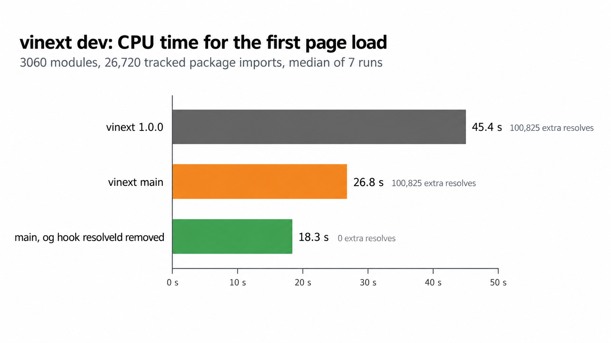

# vinext dev: the OG asset hook resolves every package import twice

Issue: [cloudflare/vinext#3637](https://github.com/cloudflare/vinext/issues/3637)

**In dev, `vinext:og-inline-fetch-assets` resolves every import of a dependency or alias a second time, even in apps that never use `next/og`.**
On this synthetic Pages Router app, the first page load on vinext `main` takes 26.8 s of CPU time. Without the hook's `resolveId` it takes 18.3 s, with identical HTML.



## Repro

```sh
npm i
npm run generate    # 60 local packages, 3060 modules
npm run compare     # about 15 minutes: 5 variants x 7 runs
npm run once        # one run of vinext 1.0.0, prints JSON stats
VINEXT=main npm run once -- --mode off
```

Each run starts the Vite dev server in a fresh process with an empty cache, requests `/` once and prints the time to the first HTML, the CPU time of the process and how often each plugin's `resolveId` ran.

`vinext` is 1.0.0 from npm. `vinext-main` is `main` at `48c00aa` from pkg.pr.new, loaded with `VINEXT=main`.

## The app

- 60 local packages (`pkg-00` … `pkg-59`), linked with `file:` and listed in `dependencies`, like workspace packages in a monorepo
- 50 modules per package. Each imports `react` and 8 modules of lower packages, e.g. `import { label } from "pkg-03/m12"`
- `pages/index.jsx` renders all of them
- no `next/og`, no `ImageResponse`, no `import.meta.url`

That is 26,720 import statements of `react` and `pkg-*` that the hook tracks.

## Numbers

Median of 7 interleaved runs, min–max in brackets. No other benchmark ran at the same time. Wall time still varies between runs, CPU time less so.

| vinext | first HTML | CPU time | `vite:resolve-dev` calls | hook calls | `this.resolve()` in hook |
|---|---:|---:|---:|---:|---:|
| 1.0.0 | 33.3 s (25.9–34.4) | 45.4 s (36.7–48.5) | 106,993 | 113,111 | 100,825 |
| 1.0.0, hook `resolveId` removed | 17.1 s (13.7–18.1) | 18.6 s (15.7–19.6) | 56,551 | 0 | 0 |
| main | 21.9 s (18.5–23.2) | 26.8 s (22.8–27.4) | 106,993 | 113,113 | 100,825 |
| main, hook `resolveId` removed | 16.4 s (13.5–16.9) | 18.3 s (16.0–19.2) | 56,551 | 0 | 0 |
| main, hook returns its `this.resolve()` result | 19.0 s (16.6–20.1) | 23.2 s (19.9–23.9) | 56,551 | 113,113 | 100,825 |

The HTML was byte-identical in all 35 runs.

`main` already caches the `realpath` and `package.json` lookups ([#3588](https://github.com/cloudflare/vinext/pull/3588)). That removed most of the 1.0.0 cost. What is left on `main` is the second resolve: about 8.5 s of CPU time here.

A large Pages Router app (~4,300 server modules) on vinext 1.0.0 showed the same pattern: the hook tracked about 56,000 of 74,000 `resolveId` calls, and removing it cut the first page load from 30.2 s to 27.3 s (one run each).

## Cause

[`og-assets.ts`](https://github.com/cloudflare/vinext/blob/48c00aa/packages/vinext/src/plugins/og-assets.ts), plugin `vinext:og-inline-fetch-assets`, `enforce: "pre"`:

```js
async resolveId(source, importer, options) {
  if (!ownership.shouldTrackImport(source)) return null;
  const resolved = await this.resolve(source, importer, { ...options, skipSelf: true });
  if (resolved === null || resolved.external) return null;
  await ownership.recordResolvedImport(source, resolved.id);
  return null;
}
```

- `shouldTrackImport` is true for a configured alias and for every bare specifier of a package in the app's `package.json`.
- `this.resolve()` runs the full resolve chain. The hook then returns `null`, so Vite runs the rest of the chain again for the same import.
- The dev server resolves each import about 4 times during the first request. Here that is 100,825 extra resolves.

The recorded package roots are only read in the `transform` hook. It runs for code that contains `import.meta.url`, and it needs them for a module outside the project root that is not under a `node_modules` path, i.e. a linked package. There they decide which directory assets may be inlined from ([#2172](https://github.com/cloudflare/vinext/pull/2172)). In this app no module contains `import.meta.url`, so the work is never used.

Returning `resolved` instead of `null` is not a drop-in fix. Vite's dev `this.resolve()` does not pass `options.kind` on, and `vite:resolve-dev` uses `kind === "require-call"` to pick the `require` condition. It also only saves 3.6 of the 8.5 s: the plugins before the hook still run twice (last row).

## Environment

vinext 1.0.0 and `main` at `48c00aa`, vite 8.3.0, rolldown 1.2.12, react 19.2.8, Node 24.13.0, macOS 26.6, Apple M1 Max.
